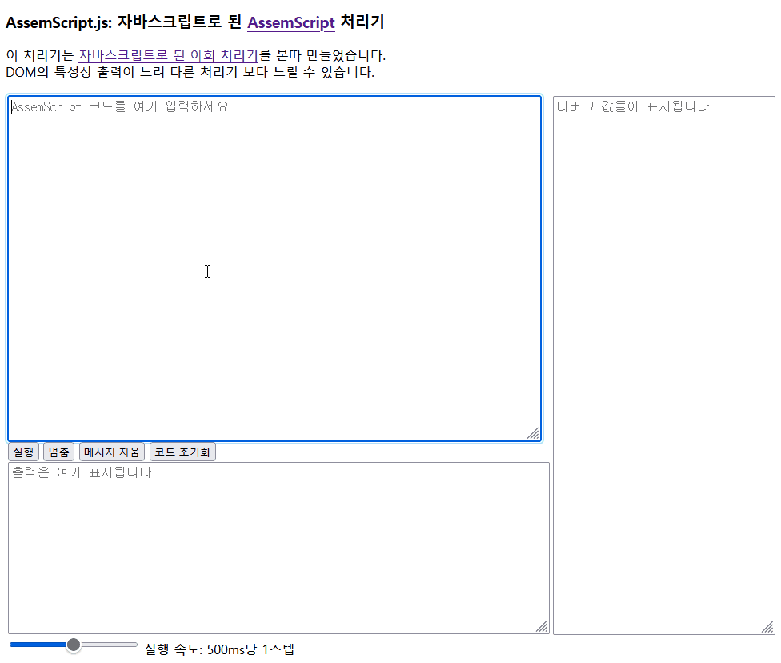

# AssemScript.js
> JavaScript fork of "[VINTO1819/AssemScript](https://github.com/VINTO1819/AssemScript)"


```c
// Save the asset "Hello, World" to 0th Asset Store
#asset 0 "Hello, World!"

// get Asset
MOV -1 // move to first argument
VAL 0 // set the argument "id" to 0
MOV -2 // move to second argument
VAL 1 // set the argument "dst" to 1, so getAsset function will copy the asset to 1th
MOV 0 // Set position to Calling Pointer
VAL 2 // set calling id to 002(getAsset)
CAL // Copy asset

// execute writeStr()
MOV -1 // move to first argument
VAL 1 // set the argument "strFrom" to 1
MOV 0 // Set position to Calling Pointer
VAL 101 // set calling id to 101(writeStr)
CAL // print string
```

\
[여기](https://static.pmh.codes/AssemScript.js/)에서 해보실 수 있습니다

## 개요
Assembly의 문법과 Brainfuck의 구동 방식을 혼합한 간편 스크립트 언어입니다.

## 진행 상황
 * 2021/04/23 : 언어 스펙 구상
 * 2021/04/24 : 개발 시작
 * 2021/04/25 : 토큰 파서 구현
 * 2021/04/26 : 문법 매처 구현 시작
 * 2021/04/27 :
   * 문법 매처 구현 완료
   * 런타임 일부 구현

## 포인터
### 상용 포인터
 * 범위 : 양수

실제 프로그램에서 사용되는 포인터입니다.

### 라이브러리 포인터
 * 범위 : 0

라이브러리를 실행하기 위한 `라이브러리 코드`를 가리키는 포인터입니다.   
라이브러리 명세서는 `라이브러리` 문단을 참고하세요.

### 인자 포인터
 * 범위 : 음수

라이브러리를 실행할 때 넘겨줄 인자값을 가리키는 포인터입니다.   
1번째 인자는 -1번째 위치에, 2번째 인자는 -2번째 위치에 접근하여 지정해야 합니다.

## 명령어
### MOV
Usage :
```
MOV 위치/nxt/prv
```
포인터 위치를 이동하는 명령어입니다.   

**인자 :**
 * 위치 : 이동할 위치
 * nxt : 현재 위치로부터 다음 위치
 * prv : 현재 위치로부터 이전 위치


### RPT
Usage :
```
RPT 위치/cur {
  코드 블록
}
```
조건에 있는 포인터가 가리키는 값이 0이 될 때까지 `코드 블록`을 반복합니다.

**인자 :**
 * 위치 : 조건 위치(변하지 않음)
 * cur : 현재 위치(포인터를 이동 시, 이동된 포인터가 조건으로 바뀜)

### CAL
Usage :
```
CAL
```
`라이브러리 포인터`에 지정된 라이브러리를 실행합니다.

### VAL
Usage :
```
VAL 값/++/--
```
현재 포인터가 가리키는 값을 수정합니다.
**인자 :**
 * 값 : 해당 값으로 설정
 * ++ : 현재 값에서 1bit 더함
 * -- : 현재 값에서 1bit 뺌

## 라이브러리
### 0번대(Basic Functions)
> 기본적인 연산자/런타임 함수
 0. N/A
 1. `copyTo(from, dst)` : from 위치에 있는 값을 dst로 복사합니다.
 2. `getAsset(id, dst)` : `#asset` 문으로 선언한 에셋을 가져옵니다.
 3. `system(cmd)` : 운영체제에서 명령어 실행합니다.
 4. `equals(a, b, dst)` : a 위치의 값과 b 위치의 값이 같은지를 확인해 dst 위치에 반환합니다.
 5. `and(a, b, dst)` : a 위치의 값과 b의 위치의 값을 and 연산자로 비교해 dst 위치에 반환합니다.
 6. `or(a, b, dst)` : a 위치의 값과 b의 위치의 값을 or 연산자로 비교해 dst 위치에 반환합니다.
 7. `not(bool, dst)` : bool 위치의 값의 NOT 값을 dst 위치에 반환합니다.
 8. `bigger(a, b, dst)` : a 위치의 값이 b 위치의 값보다 큰지 확인하여 dst 위치에 반환합니다.

### 100번대(Standard I/O)
> 입/출력
 0. `write(ascii)` : 인자값에 해당하는 위치의 값을 UTF-8 형식으로 출력합니다.
 1. `writeStr(strFrom)` : 인자값에 해당하는 위치로부터 `\0` 문자가 나올 때까지 계속 UTF-8 형식으로 출력합니다.
 2. `writeNum(number)` : 인자값에 해당하는 값을 숫자 형태로 출력합니다.
 3. `readChar(dst)` : 문자를 입력받아 dst 위치에 저장합니다.
 3. `readInt(dst)` : 숫자를 입력받아 dst 위치에 저장합니다.

### 200번대(하드웨어)
> Arduino/GPIO 지원 예정
 0. isAvailable(deviceType, dst) : 하드웨어가 사용 가능한지 확인합니다.
    * deviceType :
      * `0` : arduino
      * `1` : GPIO
      * `2` : Serial
    * dst : 0(false) 또는 1(true) 값을 전달받을 위치
 * 경고 : 해당 라이브러리는 하드웨어 종속성을 가집니다.
 * AssemScript 2.0 버전 구현체에서 출시 예정